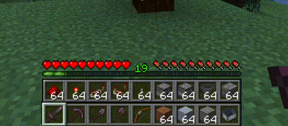
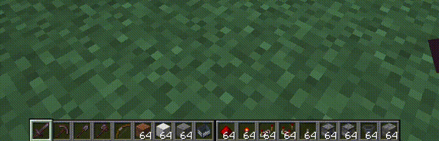

Extended Hotbar
===============

Top bar is the bottom bar of the player's inventory.

* Press `R` to swap the rows
* Press `Shift-R` to swap only the items in your hand. (Disabled by default)
* Press `=` to disable/enable
* Press `V` to enable/disable fluent mode

Hotkeys are configurable in the standard Minecraft controls settings.

Additional configuration is in the mod's menu page. [ModMenu](https://www.curseforge.com/minecraft/mc-mods/modmenu) is required for the extra configuration.

## Fluent Mode

Fluent mode can be enabled in the mod's config menu (using ModMenu). This disabled manual swapping using the `R` key,
and instead does the swapping transparently as the user scrolls along a double-wide hotbar, created by rendering the
second hotbar alongside the first, rather than on top.

## Requirements

### Required

- [Fabric Loader](https://fabricmc.net/) 0.19.3 or newer
- [Fabric API](https://modrinth.com/mod/fabric-api)
- Minecraft 1.21.11

### Optional

- [Mod Menu](https://www.curseforge.com/minecraft/mc-mods/modmenu) — adds the in-game configuration screen

### Bundled

- [Cloth Config](https://modrinth.com/mod/cloth-config) — already bundled inside the mod jar, no separate installation needed

## Credits

Maintained by [IamFelix](https://github.com/IamFelix1111).

Original author: [DenWav](https://github.com/DenWav).

Source repository: [IamFelix1111/extendedhotbar](https://github.com/IamFelix1111/extendedhotbar.git).
